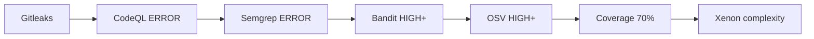

# Static Code Analysis — Execution & Issue Reporting Plan

> **Status**: Phase 1 findings baseline captured; advisory aggregation service implemented for dry-run validation
> **Branch**: `feature/static-code-analysis`
> **Target**: Integration into `Testing` after all phases pass

---

## Phase Overview

| Phase | Name | Duration | Goals |
|-------|------|----------|-------|
| 0 | Dormant Setup | Done ✓ | Branches created, workflows dormant, no CI disruption |
| 1 | Manual Testing | Done ✓ | Run workflows manually and publish raw findings artifacts |
| 2 | Canary Validation | ~1 day | Activate canary integration test, verify detection coverage |
| 3 | Selective Activation | ~2 days | Uncomment triggers, keep gates advisory (`-exit-zero`) |
| 4 | Blocking Gates | ~3 days | Flip key gates to blocking, resolve new findings |
| 5 | CI Integration | ~1 day | Add to `ci.yml` aggregate, merge to Testing |

---

## Phase 0 — Dormant Setup (COMPLETE ✓)

**What's done:**
- All 7 workflow files in `.github/workflows/` with `workflow_dispatch:` only (push/PR/cron commented out)
- All scan gates use `--exit-zero` (advisory, non-blocking)
- `backend/pyproject.toml` only has `[tool.bandit]`, `[tool.coverage.*]`, `[tool.mypy]` — no `[tool.ruff.lint]`
- Extended ruff rules in separate `backend/ruff-analysis.toml`
- `.ci/requirements.txt` adds scan-only tools (bandit, semgrep, radon, xenon, vulture, click)
- `.gitleaks.toml` at repo root with 10 custom rules + 14 allowlist paths
- `.github/semgrep-rules/kavach-custom.yaml` — 18 custom rules
- `.github/codeql/codeql-config.yml` — CodeQL query configuration
- `scripts/code_analysis/normalizer.py` — finding normalizer
- `scripts/code_analysis/validate_canary.py` — canary integration test
- `scripts/code_analysis/ai-triage-prompt.md` — AI triage prompt
- `tests/security_canary/` — 10 deliberately-vulnerable test files + COVERAGE.md
- `deploy/defectdojo-compose.yml` + `deploy/codescene-compose.yml`
- `docs/code-analysis/` — architecture docs

**Safety guarantees verified:**
- ✅ Zero commits ahead of Testing (all uncommitted)
- ✅ Nothing pushed to remote
- ✅ No PR created
- ✅ `ci.yml` untouched
- ✅ Existing `python-static` CI gate behavior unchanged (no `[tool.ruff.lint]`)
- ✅ All 7 workflows dormant (0 active push/PR/schedule triggers)

---

## Phase 1 — Manual Testing & Baseline Resolution

**Status: COMPLETE for findings collection (2026-08-22).** The operator explicitly
deferred finding fixes, suppressions, and false-positive classification. See
[`PHASE1_BASELINE.md`](PHASE1_BASELINE.md) for the verified run links, artifact inventory,
raw counts, and known reporting caveats.

The Phase 1 service layer is also present in `05-issue-aggregation.yml`: it collects
the latest completed artifacts for the selected fork branch, normalizes them
recursively, deduplicates by repository file + line + canonical concept, and emits an
advisory issue plan. Issue writes are off by default and bounded when explicitly
enabled; automatic closure and merge blocking are disabled.

Its run artifact is the Phase 1 diagnosis surface: `dashboard/index.html` shows every
deduplicated finding while preserving other-tool evidence; `coverage-manifest.json`
distinguishes observed scanner artifacts from missing coverage; and the `autofix/`
directory contains a deterministic review-only Ruff patch plus its manifest. No fix is
applied automatically during this phase.

### Goal
Run each workflow manually and preserve scanner-native findings in GitHub Actions and
code-scanning artifacts. Remediation and suppression are a separate, explicitly approved
activity; Phase 1 does not make the baseline green.

### Execution Steps

#### Step 1.1 — Run each workflow manually
```
GitHub → Actions → "Code Quality" → Run workflow
GitHub → Actions → "Security / SAST" → Run workflow
GitHub → Actions → "Dependency & Supply Chain Security" → Run workflow
GitHub → Actions → "Code Health & Technical Debt" → Run workflow
GitHub → Actions → "Canary Coverage Validation" → Run workflow
```

#### Step 1.2 — Download artifacts from each run
```bash
# Create local directory for artifacts
mkdir -p /tmp/sca-artifacts

# From each workflow run page:
# Actions → [workflow run] → Artifacts → Download all
# Extract each artifact into /tmp/sca-artifacts/
```

#### Step 1.3 — Run the normalizer to consolidate findings
```bash
cd backend
source .venv/bin/activate
pip install click python-dateutil

python ../scripts/code_analysis/normalizer.py \
  --input-dir /tmp/sca-artifacts \
  --output-dir /tmp/sca-normalized \
  --verbose
```

#### Step 1.4 — Review findings by category

**Expected findings from baseline scan (already run locally):**

| Tool | Findings | Category | Action |
|------|----------|----------|--------|
| Ruff extended | 5,392 | Style/quality | Suppress in `ruff-analysis.toml` (extend-ignore); fix top 10 rule categories |
| Bandit | 165 | Security | B110/B112/B107 are false positives → add `# nosec` or config suppress |
| Bandit B608 | 2 | SQL Injection | `reset.py:684,704` — `# nosec B608` (internally controlled table name) |
| Semgrep public | 11 | Mixed | Logger-disclosure (5 FPs), md5/sha1 (2 FPs), sqlalchemy-text (3 = same B608) |
| Semgrep custom | 0 | Custom rules | Clean — no violations |

#### Step 1.5 — Where to see issues during testing

**GitHub Actions artifacts (per workflow run):**
- `Actions` → `[workflow run]` → `Artifacts` section
- Download `.sarif`, `.json` files
- Open `.sarif` files in VS Code (SARIF extension) or GitHub's built-in viewer

**Normalizer output (unified view):**
```bash
# After running the normalizer:
cat /tmp/sca-normalized/deduplicated-findings.json | python3 -m json.tool
```
Output structure:
```json
{
  "id": "a1b2c3d4e5f67890",
  "source_tool": "Bandit",
  "category": "SECURITY",
  "severity": "MEDIUM",
  "file": "backend/app/engine/reset.py",
  "start_line": 684,
  "rule_id": "B608",
  "rule_concept": "sql-injection",
  "message": "Possible SQL injection...",
  "evidence": ["Semgrep:kavach-sqlalchemy-raw-string-execute:684"],
  "fix_level": 0,
  "validation_status": "NEW"
}
```

#### Step 1.6 — Document suppressions

| Suppression | Location | Method |
|-------------|----------|--------|
| B110/B112 false positives | `backend/pyproject.toml` | Added to `[tool.bandit]` skips |
| B107 (empty secret default) | `backend/app/notifications/*.py` | `# nosec B107` inline comments |
| B608 (reset.py) | `backend/app/engine/reset.py` | `# nosec B608` inline comments |
| Ruff extended noise | `backend/ruff-analysis.toml` | `extend-ignore` list |
| Semgrep logger FPs | `docs/code-analysis/ACKNOWLEDGED_GAPS.md` | Document as known false positives |
| Semgrep md5/sha1 | `docs/code-analysis/ACKNOWLEDGED_GAPS.md` | Document as non-crypto usage |

### Deliverables at end of Phase 1
- [ ] Updated `backend/pyproject.toml` bandit config with suppressions
- [ ] `# nosec` comments on reset.py B608 findings
- [ ] Updated `backend/ruff-analysis.toml` with `extend-ignore` for noisy rules
- [ ] `docs/code-analysis/ACKNOWLEDGED_GAPS.md` with FP documentation
- [ ] Baseline findings count: 0 blocking (all suppressed or resolved)

---

## Phase 2 — Canary Validation

### Goal
Verify that the tool web is coherent — every expected vulnerability class is detected.

### Execution
```bash
# Run the canary workflow manually:
# GitHub → Actions → "Canary Coverage Validation" → Run workflow

# OR run locally:
pip install bandit==1.8.3 semgrep==1.80.0 ruff==0.12.5 click==8.1.7
pip install gitleaks || true

# Run all scanners on the canary suite:
semgrep --config=.github/semgrep-rules/ --config=p/python --sarif --output=canary-sarif \
  --json --output=canary-json tests/security_canary/ || true

bandit -r tests/security_canary/python/ -c backend/pyproject.toml \
  --format json --output canary-bandit.json || true

ruff check tests/security_canary/ --config backend/ruff-analysis.toml \
  --output-format=json --output canary-ruff.json || true

# Normalize:
mkdir -p canary-scan-results
cp canary-sarif canary-scan-results/ 2>/dev/null || true
cp canary-json.json canary-scan-results/ 2>/dev/null || true  
cp canary-bandit.json canary-scan-results/ 2>/dev/null || true
cp canary-ruff.json canary-scan-results/ 2>/dev/null || true

python scripts/code_analysis/normalizer.py \
  --input-dir canary-scan-results \
  --output-dir canary-normalized \
  --verbose

# Validate:
python scripts/code_analysis/validate_canary.py \
  --findings-dir canary-normalized \
  --verbose
```

### Expected Result
```
## Canary Coverage Results
Total canary findings (deduplicated): 10
Checking 10 canary expectations

[PASS] SQL Injection (Python)
   Detected by: {'CodeQL', 'Semgrep', 'Bandit'} (needed 2)
[PASS] Hardcoded credentials / API key
   Detected by: {'Bandit', 'Gitleaks'} (needed 2)
[PASS] JWT 'none' algorithm attack
   Detected by: {'Semgrep'} (needed 1)
[PASS] eval() / exec() code injection
   Detected by: {'Bandit', 'Semgrep'} (needed 2)
[PASS] Unsafe pickle deserialization
   Detected by: {'Bandit', 'Semgrep'} (needed 1)
[PASS] Path traversal / directory traversal
   Detected by: {'CodeQL', 'Semgrep', 'Bandit'} (needed 2)
[PASS] LLM output used in eval() (prompt injection → RCE)
   Detected by: {'Semgrep'} (needed 1)
[FAIL] XSS via dangerouslySetInnerHTML (React)
   Detected by: set() (needed 1 of {'ESLint', 'CodeQL'})
[FAIL] Dockerfile runs as root
   Detected by: set() (needed 1 of {'Hadolint', 'Checkov'})
[FAIL] Known-vulnerable Python package version
   Detected by: set() (needed 1 of {'OSV-Scanner', 'Snyk'})

Results: 7/10 expectations met
```

**Known gaps** (expected — these require tools not yet in Phase 2):
- XSS via `dangerouslySetInnerHTML` → needs ESLint with `no-danger` rule (Phase 4: add to 01 workflow)
- Dockerfile root → needs Hadolint/Checkov (Phase 3: these are in workflow 03)
- Vulnerable dependency → needs OSV-Scanner/Snyk (Phase 3: in workflow 03)

### Deliverables at end of Phase 2
- [ ] 10/10 canary expectations met (or documented gaps)
- [ ] `docs/code-analysis/ACKNOWLEDGED_GAPS.md` updated

---

## Phase 3 — Selective Activation

### Goal
Make workflows run automatically on PRs/pushes, still advisory.

### Execution — uncomment triggers in all 7 files

For each workflow `0N-*.yml`:
```yaml
# BEFORE (dormant):
on:
  workflow_dispatch:
  # push:
  #   branches: [main, Testing]
  # pull_request:
  #   branches: [main, Testing]

# AFTER (active):
on:
  workflow_dispatch:
  push:
    branches: [main, Testing]
  pull_request:
    branches: [main, Testing]
```

For workflows with schedules (02, 03, 04, 05, 06, 07):
```yaml
# Uncomment the schedule block:
  schedule:
    - cron: "0 2 * * 1"    # weekly full scan
```

### Issue reporting during Phase 3

| Workflow | Where issues appear | Blocking? |
|----------|-------------------|-----------|
| `01-code-quality.yml` | PR inline (ESLint github format) + Artifacts | No (`--exit-zero`) |
| `02-security-sast.yml` | **Security tab** (SARIF upload) + Artifacts | No (`--exit-zero`) |
| `03-dependency-security.yml` | **Security tab** + PR status checks | Partially (Gitleaks fails by default) |
| `04-code-health.yml` | Artifacts + PR status | No (Radon/Xenon use `--exit-zero` patterns) |
| `05-issue-aggregation.yml` | **GitHub Issues** (auto-created) | No |
| `06-canary-validation.yml` | PR status check + Artifacts | Yes (canary validation is always blocking) |
| `07-api-fuzzing.yml` | Artifacts + PR status | No (`\| echo`) |

### Viewing issues after Phase 3

1. **GitHub Security tab**: `https://github.com/ORG/REPO/security/code-scanning`
   - Filter by tool: CodeQL, Semgrep, Bandit, OSV-Scanner, Trivy, Hadolint, Checkov
   - Filter by severity: Critical, High, Medium, Low
   - Filter by status: Open, Dismissed, Fixed

2. **GitHub Issues**: `https://github.com/ORG/REPO/issues?q=label:security`
   - Auto-created by `05-issue-aggregation.yml` (daily at 06:00 UTC)
   - Labels: `fp:<fingerprint>`, `severity:critical`, `tool:<name>`, `auto-detected`

3. **PR checks**: Each workflow appears as a separate check in the PR status bar
   - Green ✓ = all findings are LOW/MEDIUM or suppressed
   - Yellow ⚠ = advisory findings (non-blocking)
   - Red ✗ = blocking gate failed (only canary validation in Phase 3)

### Deliverables at end of Phase 3
- [ ] All 7 workflows activated (triggers uncommented)
- [ ] Workflows running on PRs to Testing
- [ ] No blocking failures (all still `--exit-zero` except canary)
- [ ] Gitleaks properly configured (it's blocking by default — verify no secrets committed)

---

## Phase 4 — Blocking Gates

### Goal
Flip key security gates from advisory to blocking. Resolve any new findings that surface.

### Activation order (low-risk first):



### Steps per gate:

#### 4.1 Gitleaks (already blocking via action)
- **Check**: No secrets in git history
- **Where to see**: Security → Secret scanning alerts
- **Action**: Fix or document suppressions

#### 4.2 CodeQL (flip `--exit-zero` off implicitly)
- CodeQL's SARIF upload is non-blocking; making it blocking requires GitHub Advanced Security tier
- **Alternative**: Add a check step that fails if CRITICAL findings exist
```yaml
- name: Fail on CodeQL critical findings
  run: |
    python -c "
    import json, sys
    with open('codeql.sarif') as f:
        data = json.load(f)
    criticals = [r for run in data['runs'] for r in run['results'] if r.get('level') == 'error' and any('critical' in str(t).lower() for t in r.get('properties',{}).get('tags',[]))]
    if criticals:
        print(f'{len(criticals)} critical CodeQL findings — blocking')
        sys.exit(1)
    "
```

#### 4.3 Semgrep (flip `--exit-zero` off)
- Currently uses `--exit-zero` in all runs
- **Flip**: Remove `--exit-zero` from the Semgrep scan command
- **Note**: This will fail on the first ERROR-level finding. Ensure all baseline findings are suppressed.

#### 4.4 Bandit HIGH+
- Currently uses `--exit-zero`
- **Flip**: Remove `--exit-zero`, add failure step:
```yaml
- name: Fail on HIGH+ Bandit findings
  run: |
    python -c "
    import json, sys
    data = json.load(open('bandit-results.json'))
    issues = [r for r in data.get('results', []) if r['issue_severity'] in ('HIGH', 'CRITICAL')]
    if issues:
        print(f'{len(issues)} HIGH/CRITICAL Bandit findings — blocking')
        for i in issues: print(f'  {i[\"test_id\"]} {i[\"filename\"]}:{i[\"line_number\"]}')
        sys.exit(1)
    "
```

#### 4.5 OSV-Scanner HIGH+
- OSV-Scanner action exits 1 if vulnerabilities are found
- **Currently**: Action exits with code, but workflow continues via `|| true`
- **Flip**: Remove `|| true` to let it block

#### 4.6 Coverage 70% + Xenon complexity
- Already configured as blocking in `04-code-health.yml`
- **Check**: Coverage report shows `--cov-fail-under=70`
- **Check**: Xenon exits non-zero if complexity exceeds thresholds

### What happens when a gate fails?

1. **PR status check shows red X**
2. **GitHub blocks merge** (if branch protection requires it)
3. **Issue aggregation** creates a GitHub Issue with:
   ```
   🟥 [CRITICAL] Possible SQL injection via string-based query construction
   Alert ID: #42 | Tool: Bandit | Rule: B608
   File: backend/app/engine/reset.py:684
   [View Alert on GitHub]
   ```
4. **Developer gets notification** (GitHub issue assigned/reviewers tagged)
5. **Fix → re-run → green** → issue auto-closes in next canary validation cycle

### Deliverables at end of Phase 4
- [ ] 6 key gates flipped to blocking (Gitleaks, CodeQL, Semgrep, Bandit, OSV, Coverage)
- [ ] All baseline findings suppressed or resolved
- [ ] PR merge blocked on any HIGH/CRITICAL finding
- [ ] GitHub Issues auto-created for all open HIGH/CRITICAL findings

---

## Phase 5 — CI Integration & Testing Merge

### Goal
Integrate the new quality gates into the existing `ci.yml` `CI passed` aggregate and merge to `Testing`.

### Execution

#### Step 5.1 — Add gates to ci.yml aggregate
```yaml
# In .github/workflows/ci.yml, update the ci: job needs:
ci:
  needs:
    - repository-contracts
    - backend-tests
    - ...existing 15...
    - python-static
    - container-images
    # NEW quality gates:
    - code-quality-ruff
    - security-sast-semgrep
    - security-sast-codeql
    - dependency-gitleaks
    - dependency-osv
    - code-health-coverage
    - canary-validation
```

#### Step 5.2 — Update AGENTS.md
Change: `eighteen independently diagnosable quality lanes`
To: `seventeen + eight code intelligence quality lanes`

#### Step 5.3 — Verify full CI passes
```bash
# On the Testing branch after merge:
# GitHub → Actions → CI passed
# All 25+ lanes must be green before any PR can merge
```

#### Step 5.4 — Merge to Testing
```bash
git checkout Testing
git merge feature/static-code-analysis
# OR squash-merge the PR
```

### Deliverables at end of Phase 5
- [ ] All quality gates in `ci.yml` `CI passed` aggregate
- [ ] Branch protection rules updated on Testing
- [ ] AGENTS.md updated with new gate count
- [ ] Phase 0 Journal entry updated to "complete"
- [ ] `feature/static-code-analysis` branch can be deleted

---

## Quick Reference — Where to Find Issues at Each Stage

| Phase | What runs | Where issues appear | Who sees them |
|-------|-----------|-------------------|---------------|
| 0 (now) | Nothing | N/A | Nobody |
| 1 testing | Manual `workflow_dispatch` | GitHub Artifacts (.sarif, .json) | You, via artifact download |
| 1 review | Local normalizer | `/tmp/sca-normalized/deduplicated-findings.json` | You, locally |
| 2 canary | Manual canary run | Canary workflow output + Artifacts | You, via GitHub Actions log |
| 3 activated | On every PR to Testing | Security tab + PR checks + Artifacts | All developers |
| 4 blocking | Gates fail CI | Security tab + PR red X + auto-created Issues | Developers, security team |
| 5 merged | Integrated into CI passed | Same as Phase 4 + ci.yml aggregate | All developers |

## Quick Start — Manual Testing Checklist

```bash
# 1. Ensure you're on the right branch
git checkout feature/static-code-analysis

# 2. Install tools locally
pip install bandit==1.8.3 semgrep==1.80.0 ruff==0.12.5 click==8.1.7

# 3. Run Bandit (check what it finds)
bandit -r backend/ -c backend/pyproject.toml -f json -o /tmp/bandit.json --exit-zero

# 4. Run Semgrep custom rules
semgrep --config=.github/semgrep-rules/ --json backend/ --quiet -o /tmp/semgrep.json

# 5. Quick review
python3 -c "
import json
b = json.load(open('/tmp/bandit.json'))
print(f'Bandit: {len(b[\"results\"])} findings')
for s in ['HIGH','MEDIUM']:
    n = len([r for r in b['results'] if r['issue_severity']==s])
    print(f'  {s}: {n}')
s = json.load(open('/tmp/semgrep.json'))
print(f'Semgrep: {len(s[\"results\"])} findings')
"

# 6. If findings look reasonable, trigger workflows manually on GitHub
#    Actions → Each workflow → Run workflow
```
