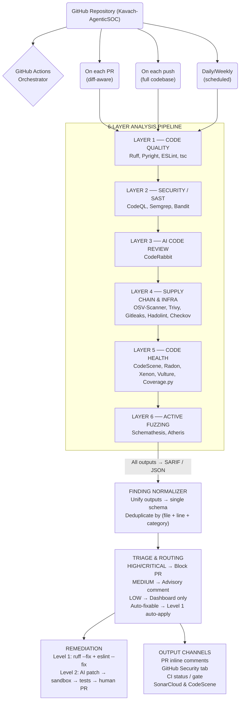
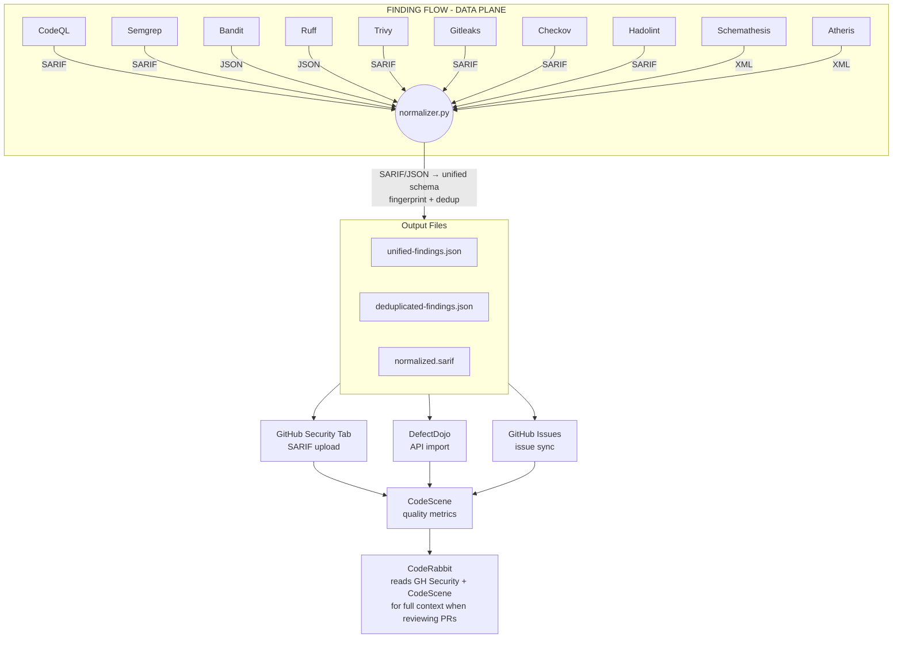

# Kavach-AgenticSOC — Code Intelligence & Security Analysis

> Multi-layer, defense-in-depth code analysis system combining deterministic
> static analysis, dependency scanning, secret detection, code health
> monitoring, API fuzzing, and AI-assisted triage.

## Table of Contents

1. [System Overview](#1-system-overview)
2. [Tool Pool — Full Candidate List](architecture/TOOL_POOL.md)
3. [Selected Stack](#3-selected-stack)
4. [Architecture Diagram](#4-architecture-diagram)
5. [GitHub Actions Workflows](#5-github-actions-workflows)
6. [CI Gate Policy](#6-ci-gate-policy)
7. [Auto-Fix Policy](#7-auto-fix-policy)
8. [Unified Finding Schema](#8-unified-finding-schema)
9. [Deployment & On-Prem Constraints](#9-deployment--on-prem-constraints)
10. [Implementation Roadmap](#10-implementation-roadmap)

---

## 1. System Overview

### The Core Design Principle

> **Use deterministic tools for broad, repeatable detection.**  
> **Use AI agents for contextual reasoning, triage, and limited remediation.**  
> **Never use AI to replace what a scanner can answer definitively.**

This architecture avoids two failure modes:
- *"Just run one AI reviewer"* — misses deterministic security patterns, high false-negative rate
- *"Run 40 tools and dump 10,000 warnings"* — alert fatigue, no signal-to-noise

Instead it uses **layered ensemble analysis → normalization → deduplication →
AI triage → safe remediation**.

### Repository Context

| Attribute | Value |
|-----------|-------|
| Repository | Kavach-AgenticSOC |
| Backend | Python 3.11, FastAPI, LangGraph, SQLAlchemy, aiosqlite, Redis, Elasticsearch/OpenSearch |
| Frontend | TypeScript, React 18, Vite, Tailwind, Radix UI, ESLint, tsc |
| Tests | pytest (~2,300) + Vitest (~1,900) |
| Existing tools | Ruff, ESLint, tsc, GitHub Actions |
| Deployment | Docker Compose, on-prem |
| Security level | HIGH — SOC product with RBAC, MFA/TOTP, SSO/OIDC, JWT (stdlib HS256), audit logging |
| Network | Potentially air-gapped / restricted — external SaaS tools require explicit approval |

---

## 2. Selected Stack

> **Implementation status:** This is the proposal shortlist, not a claim that every
> entry is operational. The authoritative verified/partial/not-implemented inventory
> and current phase evidence are in [`EXECUTION_PLAN.md`](EXECUTION_PLAN.md).

### Core Toolchain

```
Surface                 Primary              Secondary / Notes
──────────────────────  ──────────────────── ──────────────────────────
Python lint + format    Ruff                 (already present in ci.yml)
Python security         Bandit               AST-based Python security
Python types            Pyright              Microsoft type checker
TS/React lint           ESLint + tsc         (already present)
Multi-lang SAST         CodeQL               GitHub native semantic analysis
Pattern SAST            Semgrep              Custom Kavach rules + OWASP
Dependency CVEs         OSV-Scanner          Google-backed vulnerability DB
Secret detection        Gitleaks             Scan code + git history
Container/IaC           Trivy + Hadolint     Image CVEs + Dockerfile linting
                        Checkov              IaC (Docker Compose, GH Actions)
Code health             CodeScene            On-prem behavioral hotspot analysis
Complexity              Radon + Xenon        Cyclomatic complexity CI gate
Dead code               Vulture              Static dead code detection
Test coverage           Coverage.py          Runtime dead-code evidence
API fuzzing             Schemathesis         OpenAPI property-based fuzzing
Python fuzzing          Atheris              Coverage-guided state machine fuzzer
AI code review          CodeRabbit OSS       Free for open-source (cloud)
                        PR-Agent OSS         Self-hosted fallback
Finding aggregation     DefectDojo           Self-hosted vulnerability management
```

## 3. Architecture Diagram



## 4. Architecture Diagram



## 5. GitHub Actions Workflows

| Workflow | File | Trigger | Tools |
|----------|------|---------|-------|
| Code Quality | `01-code-quality.yml` | PR + push | Ruff, Pyright, ESLint, tsc, Bandit |
| Security/SAST | `02-security-sast.yml` | PR + push + weekly | CodeQL, Semgrep, Bandit |
| Dependency Security | `03-dependency-security.yml` | PR + push + daily | OSV-Scanner, Trivy, Gitleaks, Hadolint, Checkov |
| Code Health | `04-code-health.yml` | PR + weekly | Radon, Xenon, Vulture, Coverage.py |
| Advisory Finding Aggregation | `05-issue-aggregation.yml` | Manual only | Latest scanner artifacts, normalization, fingerprint dedupe, optional GitHub Issues |
| Canary Validation | `06-canary-validation.yml` | Weekly + config changes | All scanners + validate |
| API Fuzzing | `07-api-fuzzing.yml` | Saturday weekly + PR | Schemathesis |

### CI Gate Summary

> **Current fork policy (Phase 1): advisory only.** The analysis workflows are
> manual-only, do not supply required checks, and do not change branch protection.
> The table below is a future policy proposal, not the active repository behavior.

| Condition | Action |
|-----------|--------|
| Secret / credential found | **Block PR** |
| CodeQL security finding (HIGH+) | **Block PR** |
| Semgrep OWASP violation (HIGH+) | **Block PR** |
| Bandit HIGH vulnerability | **Block PR** |
| Vulnerable dependency introduced (HIGH+) | **Block PR** |
| Gitleaks secrets found | **Block PR** |
| Trivy CRITICAL CVE | **Block PR** |
| Hadolint ERROR | **Block PR** |
| Ruff lint errors | **Block PR** |
| TypeScript / Pyright type errors | **Block PR** |
| Xenon complexity exceeded | **Block PR** |
| Coverage below 70% | **Block PR** |
| CodeRabbit AI review | Advisory comment (non-blocking) |
| Vulture dead code | Advisory (non-blocking) |
| MEDIUM findings | Advisory (non-blocking) |

## 6. Auto-Fix Policy

### Level 0 — NO auto-fix (human required)
Security-critical code requiring expert review:
- Authentication flows (login, token issuance, session creation)
- Authorization checks (RBAC, permission validators)
- MFA/TOTP validation
- JWT signing and verification (`backend/app/auth/tokens.py`)
- OAuth/OIDC token exchange
- Agent tool permissions and allowlists (`backend/app/tools/`)
- Elasticsearch index scoping / read-only enforcement (`backend/app/es/`)
- Audit logging
- Rate limiting logic
- CSRF protection

### Level 1 — Safe auto-fix (applies immediately)
Non-breaking formatting and style changes:
- Python: `ruff --fix` (unused imports, style, simple lint)
- TypeScript: `eslint --fix` (auto-fixable rules)
- Import ordering, trailing commas, whitespace

### Level 2 — AI-proposed fix (sandbox + human approval)
Complex code changes proposed by AI, validated before merging:
1. AI generates patch (in isolated branch)
2. Patch applied to sandbox
3. Full test suite runs (`pytest` + `vitest`)
4. Linters re-run (`ruff`, `eslint`, `tsc`)
5. Security scanners re-run (CodeQL, Semgrep, Bandit)
6. If all pass → PR created for human approval
7. Human reviews diff → approves or rejects

## 7. Unified Finding Schema

See `scripts/code_analysis/normalizer.py` for the full schema and
`scripts/code_analysis/normalizer.py` for the Concept Normalization Map.

Key fields:
- `id`: Stable SHA256 fingerprint = `SHA256(file:line:concept)[:16]`
- `source_tool`: Which tool detected it
- `category`: SECURITY | QUALITY | DEAD_CODE | COMPLEXITY | DEPENDENCY | SECRET
- `severity`: CRITICAL | HIGH | MEDIUM | LOW | INFO
- `rule_concept`: Canonical concept (e.g., `sql-injection`, `jwt-none-alg`)
- `duplicate_group`: ID of canonical finding if this is a duplicate
- `evidence`: List of corroborating tool findings
- `validation_status`: State machine lifecycle state

### Advisory issue synchronization

`05-issue-aggregation.yml` downloads the latest completed scanner artifacts for the
selected fork branch and recursively normalizes supported SARIF/JSON files. Findings
from overlapping tools share one fingerprint when their repository-relative file,
line, and canonical concept match.

The workflow defaults to `apply_issues: false`. In that mode it only uploads
`issue-sync-plan.json`, the normalized artifacts, and `dashboard/index.html`. The
dashboard is a dependency-free searchable view of every unique finding, with filters
for severity, tool, category, file/rule/message search, retained corroborating evidence,
diagnosis guidance, scanner-artifact coverage, runtime coverage when available, and
review-only autofix eligibility. An operator must deliberately
select `apply_issues: true` to create issues. Only HIGH/CRITICAL findings are eligible,
new issues are capped (25 by default), and each issue carries both an `fp:<id>` label
and an embedded fingerprint marker for idempotency. This phase never closes issues;
the three-clean-scan plus targeted-rescan closure policy remains future work.

The same artifact contains `dashboard/coverage-manifest.json` and
`autofix/ruff-safe-fixes.patch`. The latter is generated with Ruff's safe-fix diff mode:
it is a proposal for review and does not edit, commit, push, or open a pull request.
Download the aggregation artifact from its GitHub Actions run and open
`dashboard/index.html` locally to inspect the complete finding set in one place.

## 8. Deployment & On-Prem Constraints

### Self-Hosted Runner Requirements
All CI jobs run on GitHub-hosted runners (`ubuntu-latest`). For fully
air-gapped environments, use self-hosted runners:
- Source code never leaves the on-prem environment
- No external internet access required for deterministic analysis tools
- Tools that download rule databases (Semgrep, OSV-Scanner) can use
  cached/offline modes

### Tool Data Flow

| Tool | Code leaves env? | Network required? | Self-hosted? |
|------|-----------------|------------------|--------------|
| Ruff | No | No | pip |
| Bandit | No | No | pip |
| Pyright | No | No | npm |
| CodeQL | No | No | CLI binary (GitHub-provided) |
| Semgrep | No (OSS rules) | Only to download rules | pip |
| OSV-Scanner | No | Only downloads vuln DB | binary |
| Trivy | No | Only downloads vuln DB | binary |
| Gitleaks | No | No | Go binary (via action) |
| Hadolint | No | No | Docker (via action) |
| Checkov | No | No | pip |
| Radon/Xenon | No | No | pip |
| Vulture | No | No | pip |
| CodeScene | No (on-prem) | No | Docker Compose |

### Vulnerability Database Caching
For fully air-gapped environments:
```bash
# Trivy DB cache
trivy image --download-db-only --cache-dir /opt/trivy-cache

# OSV-Scanner — pre-download vulnerability database
osv-scanner --download-vuln-db --cache-dir /opt/osv-cache

# Semgrep — use bundled rules (no network needed)
semgrep --config=.github/semgrep-rules/ --no-rewrite-rule-messages .
```

## 9. Implementation Roadmap

### Phase 1 — Foundation (Week 1–2)
- [x] Deploy `01-code-quality.yml`: Ruff, Pyright, ESLint, tsc, Bandit
- [x] Enable Dependabot + GitHub Dependency Review (already configured)
- [ ] Establish baseline; fix or suppress existing issues
- [ ] Register with CodeScene free tier for hotspot analysis

### Phase 2 — Security Hardening (Week 2–3)
- [x] Deploy `02-security-sast.yml`: CodeQL, Semgrep, Bandit
- [x] Add 15 custom Semgrep rules (`kavach-custom.yaml`)
- [x] Deploy `03-dependency-security.yml`: OSV-Scanner, Trivy, Gitleaks, Hadolint, Checkov
- [ ] Enable GitHub Advanced Security: CodeQL + Secret Scanning (repository Settings)
- [ ] Enroll in Snyk OSS Developer Program (free enterprise features)

### Phase 3 — Finding Normalization (Week 3–4)
- [x] Deploy `normalizer.py` as a post-CI step
- [x] Configure SARIF upload to GitHub Security tab
- [x] Set up deduplication + correlation
- [x] Create canary test suite (`tests/security_canary/`)
- [ ] Deploy `06-canary-validation.yml` for integration testing

### Phase 4 — AI Triage + Remediation (Week 4–5)
- [x] Deploy AI Triage Agent prompt (`scripts/code_analysis/ai-triage-prompt.md`)
- [x] Configure Level 1 safe-fix automation (ruff --fix + eslint --fix in CI)
- [ ] Set up Level 2 AI-proposed fix pipeline with sandbox validation
- [ ] Deploy `05-issue-aggregation.yml` for auto-issue creation

### Phase 5 — Code Health Dashboard (Week 5–6)
- [x] Add Radon + Xenon complexity CI gate (`04-code-health.yml`)
- [x] Add Vulture dead code detection
- [x] Add Coverage.py test coverage gate (70% minimum)
- [ ] Deploy CodeScene on-prem (Docker Compose: `deploy/codescene-compose.yml`)
- [ ] Integrate DefectDojo for vulnerability management (`deploy/defectdojo-compose.yml`)
- [ ] Validate effectiveness with canary coverage suite

## 10. Tool Evaluation Matrix

| Tool | Code Q | SAST | Security | Dead Code | Complexity | Deps | Secrets | PR | GH Actions | SARIF | On-Prem | Cost |
|------|--------|------|----------|-----------|------------|------|---------|----|----|-------|---------|------|
| **Ruff** | ✓ | — | ✓ (S-rules) | — | — | — | — | ✓ | ✓ | JSON | ✓ | Free |
| **Pyright** | ✓ | — | — | — | — | — | — | ✓ | ✓ | JSON | ✓ | Free |
| **ESLint** | ✓ | — | — | — | — | — | — | ✓ | ✓ | JSON | ✓ | Free |
| **tsc** | ✓ | — | — | — | — | — | — | ✓ | ✓ | JSON | ✓ | Free |
| **CodeQL** | — | ✓ | ✓ | — | — | — | — | ✓ | ✓ | SARIF | ✓ | Free* |
| **Semgrep** | — | ✓ | ✓ | — | — | — | — | ✓ | ✓ | SARIF | ✓ | Free |
| **Bandit** | — | — | ✓ | — | — | — | — | ✓ | ✓ | SARIF | ✓ | Free |
| **Qodana** | ✓ | ✓ | ✓ | — | — | — | — | ✓ | ✓ | SARIF | ✓ | Free |
| **OSV-Scanner** | — | — | — | — | — | ✓ | — | ✓ | ✓ | SARIF | ✓ | Free |
| **Trivy** | — | — | ✓ | — | — | ✓ | — | ✓ | ✓ | SARIF | ✓ | Free |
| **Gitleaks** | — | — | — | — | — | — | ✓ | ✓ | ✓ | JSON | ✓ | Free |
| **Hadolint** | — | — | ✓ | — | — | — | — | ✓ | ✓ | SARIF | ✓ | Free |
| **Checkov** | — | — | ✓ | — | — | — | ✓ | ✓ | ✓ | SARIF | ✓ | Free |
| **CodeScene** | — | — | — | — | ✓ | — | — | ✓ | ✓ | — | ✓ | Free tier |
| **Radon** | — | — | — | — | ✓ | — | — | ✓ | ✓ | JSON | ✓ | Free |
| **Xenon** | — | — | — | — | ✓ | — | — | ✓ | ✓ | — | ✓ | Free |
| **Vulture** | — | — | — | ✓ | — | — | — | ✓ | ✓ | JSON | ✓ | Free |
| **Coverage.py** | — | — | — | ✓ | — | — | — | ✓ | ✓ | XML | ✓ | Free |

> `*` CodeQL requires GitHub Advanced Security license for private repos (free for public)

---

*Generated by Kavach-AgenticSOC Code Intelligence Architecture*  
*August 2026 · Version 1.0*
